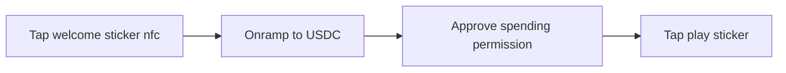

# mamecoin-base-batch-2025

Our project entry for base batch na 2025
# TLDR: what is MameCoin?
MameCoin allows arcade owners retrofit crypto payments alongside their existing payment mechanisms for physical and digital arcade machines.
# High level user flow

